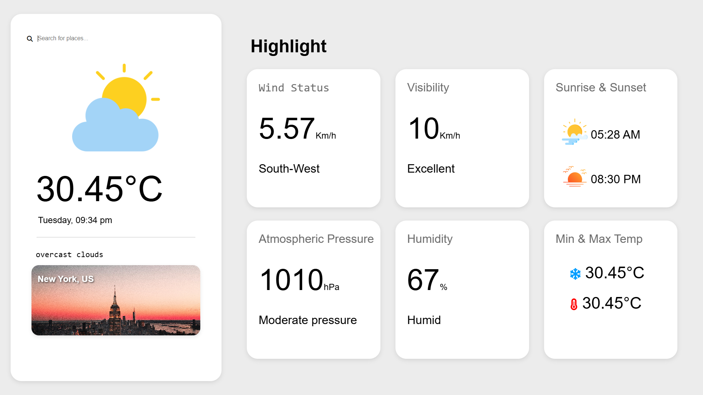

# 🌦️ Weather App

A responsive weather application that fetches real-time weather data and beautiful city images using the **OpenWeather API** and **Unsplash API**. This app displays temperature, weather condition, wind speed and direction, visibility, atmospheric pressure, humidity, and sunrise/sunset time.

---

## 🚀 Features

- 🔍 Search weather by city name
- 🧭 Real-time weather info: Temperature, Wind, Humidity, etc.
- 🌄 Auto-changing background image based on the searched city
- 🌤️ Dynamic weather icons based on weather conditions
- 🕐 Local day and time display
- 💾 Loader and error message display
- 📱 Responsive layout (desktop-first)

---

## 🔧 Tech Stack

- **HTML5**
- **CSS3** (Flexbox, responsive UI)
- **JavaScript (ES6)** – Async/Await, Fetch API
- **OpenWeatherMap API**
- **Unsplash API**
- **Font Awesome** (icons)

---

## 📂 Folder Structure

```
weather-app/
├── index.html
├── style.css
├── logic.js
├── icons/             # Weather icons (sun, rain, storm, etc.)
└── README.md
```

---

## 📸 Screenshots



---

## 🛠️ How to Run

1. Clone the repository:
   ```bash
   git clone https://github.com/VinayPratap07/WeatherWebApplication.git
   ```

2. Replace the placeholders in `logic.js` with your API keys:
   ```js
   const apiKey = "YOUR_OPENWEATHER_API_KEY";
   const apiKeyCityImages = "YOUR_UNSPLASH_API_KEY";
   ```

3. Open `index.html` in any modern browser.

---

## 🧠 Improvements for the Future

- [ ] Mobile-first responsiveness with better layout on phones
- [ ] Dark/light theme toggle
- [ ] Autocomplete for city names
- [ ] Weather forecast (next 3 days)
- [ ] Store search history

---

## 🙋‍♂️ Author

Made with ❤️ by **Vinay Pratap**

Feel free to check out more of my projects on GitHub.

---

## 📄 License

This project is licensed under the [MIT License](LICENSE).

